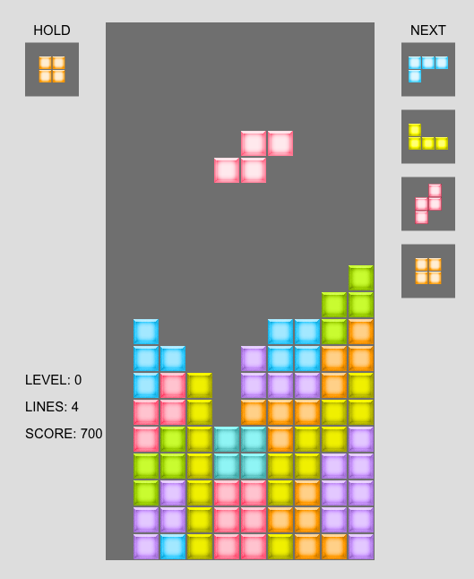

# TETRIS *俄罗斯方块*

### 开发
* 使用 *TypeScript* 开发的俄罗斯方块游戏
* 使用 `CreateJs`: 一个基于 `canvas` 的 HTML5 游戏开发引擎。开发体验非常接近 Flash (as3.0), API 都是参造 as3.0 设计的，对于玩过 Flash 的人来说，学习成本非常低。
* 使用 `gulp` + `webpack` 进行构建: `webpack` 用于 `TypeScript` 的编译与打包，`gulp` 用于其他资源的构建

### 使用
* `git clone` 到本地
* 进入项目目录，执行 `npm install` 安装依赖
* 开发调试： `npm start` 编译并运行服务，监听文件修改。浏览器打开 `http://localhost:9999/` 即可运行游戏。
* 编译： `npm run build`
* 清除编译文件： `npm run clean`

### 操作
* 回车键: 开始游戏，游戏中则为暂停/恢复功能
* 箭头上: 旋转方块
* 箭头下/左/右: 下移/左移/右移方块
* 空格键: 方块快速下落到底部
* z键: 替换当前方块与Hold方块，一个回合只能使用一次

### 截图

### TODO
* 完善UI界面
* 下落、消除等动作动画效果
* 背景音乐、音效
* 等等